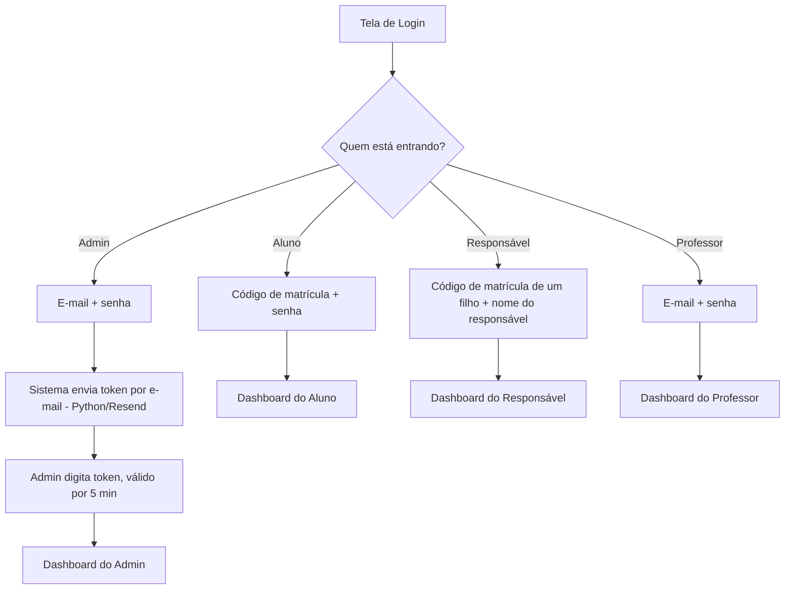
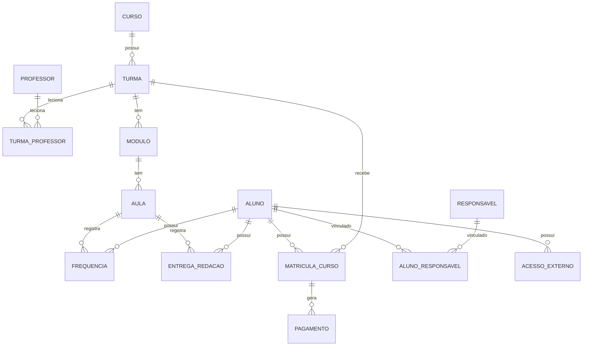
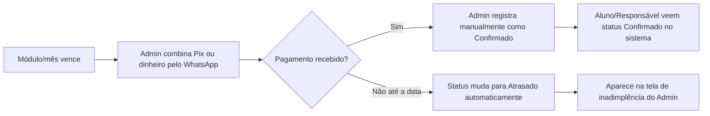

# Especificação Técnica e Funcional — Sistema "Redação Nota Mil"

> **Como usar este documento:** este arquivo foi escrito para ser colado como
> contexto inicial em uma conversa com o Claude (ideal: Claude Code) para
> construir o sistema. Ele reúne regras de negócio, modelo de dados, telas,
> identidade visual e stack técnica. Sugestões de terceiros (bibliotecas,
> serviços gratuitos, nomes de tabelas) foram marcadas como tal — o dono do
> projeto pode ajustar qualquer uma delas antes ou durante a construção.
> Pontos em que eu (Claude) tomei uma decisão por conta própria estão
> reunidos na seção 20 ("Premissas assumidas"), para revisão rápida.

---

## 1. Visão Geral

- **Nome do curso/negócio:** Redação Nota Mil
- **Endereço:** Rua F, QD.19, Lt.01, Sala Parque Tremendão — Goiânia (GO)
- **O que é:** plataforma de gestão acadêmica para uma escola com três
  cursos (Redação, Exatas e Matemática), com quatro perfis de acesso:
  **Administrador, Professor, Aluno e Responsável**.
- **Objetivo do sistema:**
  - Administrar cursos, turmas, professores, matrículas e pagamentos.
  - Permitir que o professor acompanhe o desenvolvimento das próprias
    turmas (frequência, entregas de redação, relatórios).
  - Permitir que aluno e responsável acompanhem o desempenho, frequência,
    calendário de aulas, avisos e acessos externos.
- **Plataformas:** web primeiro (uso no navegador), com arquitetura pronta
  para reaproveitamento em app mobile depois (ver seção 2).

---

## 2. Stack Tecnológica Sugerida

O pedido original citava Supabase, Neon e Prisma. Pesquisei o estado atual
(julho/2026) de cada opção para recomendar a combinação mais sólida e mais
barata para o tamanho deste projeto (poucas centenas de alunos).

### 2.1 Recomendação principal

| Camada | Ferramenta sugerida | Por quê |
|---|---|---|
| Frontend + Backend | **Next.js** (App Router) em TypeScript | Um único projeto serve páginas web e API; deploy nativo na Vercel; mesma base de código pode alimentar o app mobile depois via API. |
| Estilo | Tailwind CSS | Rápido para montar 4 áreas visuais diferentes (aluno, professor, admin, e 3 cores de curso) de forma consistente. |
| Banco de dados | **Neon (Postgres serverless)** | Postgres padrão (funciona com qualquer ORM), plano gratuito permanente (sem cartão), "escala a zero" quando ocioso — ideal para o tráfego baixo/médio de uma escola. |
| ORM | **Prisma** | Como você já mencionou — schema tipado, migrations versionadas, funciona muito bem com Neon e com Vercel. |
| Autenticação | **Auth.js (NextAuth) com "Credentials Provider"** customizado | Os logins daqui **não** são o padrão e-mail+senha comum (matrícula, matrícula do filho, token por e-mail) — por isso a autenticação será escrita sob medida, e o Auth.js só cuida da sessão (cookie httpOnly, JWT). |
| Armazenamento de arquivos | **Supabase Storage** (usado só como storage, não como banco) *ou* **Vercel Blob** | Para eventuais uploads (ex.: foto/PDF de redação, comprovante de pagamento). Ambos têm free tier; ver 2.3. |
| Notificações push | **OneSignal** | Free tier cobre até 10.000 assinantes web e envios ilimitados de push mobile — muito acima do necessário aqui. |
| E-mail (token do admin) | **Resend** (com fallback SMTP/Gmail) | Ver seção 17 e o script `enviar_token_admin.py` entregue junto com este documento. |
| Versionamento | Git + GitHub (repositório privado) | Padrão de mercado, gratuito para repositórios privados. |
| Deploy | **Vercel** | Integração nativa com Next.js, deploy automático a cada push. |

### 2.2 Por que Neon + Prisma (e não Supabase como banco principal)

O Supabase é uma ótima plataforma "tudo em um" (banco + auth + storage),
mas o **Auth do Supabase é pensado para login por e-mail/senha ou OAuth**,
e este projeto precisa de 4 tipos de login não convencionais (matrícula,
matrícula do filho + nome, e-mail + senha + token). Por isso, o mais limpo
é: banco de dados puro no Neon, autenticação escrita à mão com Prisma, e
usar o Supabase **apenas para armazenamento de arquivos**, se necessário.

### 2.3 Limites dos planos gratuitos (verificados em julho/2026)

| Serviço | Plano gratuito | Suficiente para este projeto? |
|---|---|---|
| Neon | 100 CU-hora/mês, 0,5 GB por projeto, sem cartão, permanente | Sim, com folga para uma escola deste porte. |
| Supabase (só Storage) | 1 GB de arquivos, 2 projetos; projeto "pausa" após 7 dias sem uso (acorda ao ser acessado) | Sim, para poucos arquivos. |
| Vercel Blob | 1 GB de armazenamento no plano Hobby | Alternativa ao Supabase Storage. |
| Resend | 3.000 e-mails/mês, 100/dia, 1 domínio | Sim, sobra muito (só o admin recebe token). |
| OneSignal | Push mobile ilimitado; até 10.000 assinantes web | Sim, muito acima da escala atual. |
| GitHub | Repositórios privados ilimitados | Sim. |

> ⚠️ **Ponto de atenção importante sobre a Vercel:** o plano gratuito
> ("Hobby") da Vercel, pelos termos de uso atuais, é destinado a **projetos
> pessoais/não comerciais**. Como este é um sistema de um negócio que cobra
> mensalidade, o uso correto dentro das regras da Vercel é o plano **Pro
> (US$ 20/mês)**. É comum ver pequenos negócios rodando no Hobby sem
> problemas na prática, mas o correto — e o que recomendo — é considerar
> esse único custo fixo de ~US$ 20/mês como parte do orçamento do projeto.
> Se a ideia for manter tudo 100% gratuito mesmo sendo comercial, a
> alternativa é hospedar em serviços sem essa restrição (ex.: Cloudflare
> Pages, Railway, Render), com um pouco mais de configuração.

### 2.4 Caminho para o mobile

Quando for a hora de subir para o mobile, a recomendação é **React Native
com Expo**, reaproveitando 100% da API já construída no Next.js. Nenhuma
regra de negócio precisa ser reescrita — só a camada visual.

---

## 3. Perfis de Usuário e Autenticação

| Perfil | Login | Senha |
|---|---|---|
| Aluno | Código de matrícula | Senha própria (definida/reset pelo admin) |
| Responsável | Código de matrícula **de qualquer um dos filhos** | Nome do responsável (ver regra de geração abaixo) |
| Professor | E-mail | Senha própria |
| Administrador | E-mail | Senha + **token de 6 dígitos** enviado por e-mail, válido por **5 minutos** |

### 3.1 Código do Aluno (identidade, não confundir com "matrícula" como ato)

Para evitar ambiguidade no sistema, este documento separa dois conceitos
que na fala do dia a dia se chamam igualmente de "matrícula":

- **Código do Aluno**: identificador único e permanente da pessoa,
  usado para login. Sugestão de formato: `RNM2026-0001`
  (RNM = Redação Nota Mil + ano de ingresso + sequencial). Não muda mesmo
  que o aluno troque de curso, turma ou saia e volte.
- **Matrícula (ato)**: o vínculo do aluno a um curso + turma + plano em um
  determinado período. É isso que é renovado a cada módulo/rematrícula.

### 3.2 Geração da senha do Responsável (e o que fazer em caso de nome repetido)

Regra sugerida, fácil de aplicar e de lembrar:

1. Senha-base = primeiro nome + primeiro sobrenome do responsável, tudo em
   minúsculas, sem acento e sem espaço.
   Exemplo: "Maria Aparecida Silva" → `mariasilva`.
2. **Se, para o mesmo aluno, já existir outro responsável cadastrado com a
   senha-base idêntica** (caso raro de homônimos), o sistema deve gerar
   automaticamente uma variação, acrescentando os 2 últimos dígitos do
   telefone do responsável ao final. Exemplo: `mariasilva87`.
3. Em qualquer um dos dois casos, o sistema deve **mostrar a senha final
   gerada na tela do admin**, no momento do cadastro, para que ele possa
   repassá-la ao responsável (por WhatsApp, por exemplo).
4. Mesmo sendo uma senha "previsível", ela deve ser **guardada com hash**
   (bcrypt ou argon2) no banco, nunca em texto puro — é uma prática de
   segurança obrigatória independente de como a senha foi gerada.

> Assumi que "seu nome" (citado no pedido original) se refere ao nome do
> **próprio responsável** — e não ao nome do aluno. Se a intenção era usar
> o nome do aluno como senha, é só trocar o campo de origem no passo 1;
> o restante da regra (fallback de colisão) continua igual.

### 3.3 Login do Administrador (e-mail + senha + token)

1. Admin digita e-mail e senha.
2. Sistema confere e-mail/senha.
3. Sistema gera um código numérico de 6 dígitos, salva no banco com data de
   expiração (agora + 5 minutos) e envia por e-mail (script em Python,
   seção 17).
4. Admin digita o código na tela seguinte.
5. Sistema valida: código bate **e** ainda não expirou **e** ainda não foi
   usado. Após 5 tentativas erradas, invalida o código e obriga reenvio.
6. Um novo código só pode ser reenviado a cada 60 segundos (evitar spam).

### 3.4 Vínculo entre Responsável e Aluno

- Um responsável pode ter **vários filhos** matriculados.
- Um aluno pode ter **mais de um responsável** (pai, mãe, etc.), cada um
  com login próprio.
- Ao logar, se o responsável tiver mais de um filho, o sistema deve mostrar
  um seletor de aluno no topo do Dashboard, e todas as telas (frequência,
  calendário, avisos) devem respeitar o filho selecionado.
- **Isolamento de dados obrigatório:** um responsável nunca pode ver dados
  de um aluno que não seja seu filho — validado no backend em toda consulta
  (não apenas escondido na tela).

---

## 4. Estrutura Acadêmica Atual (dados de carga inicial / seed)

### 4.1 Cursos, turmas, professores e horários

| Curso | Turma | Professor(es) | Dia | Horário |
|---|---|---|---|---|
| Redação | R1 | Martinha | Terça | 18h00 – 19h30 |
| Redação | R2 | Martinha | Terça | 19h30 – 21h00 |
| Redação | R3 | Martinha | Sábado | 07h30 – 09h00 |
| Redação | R4 | Martinha | Sábado | 09h00 – 10h30 |
| Redação | R5 | Martinha | Sábado | 10h30 – 12h00 |
| Redação | R6 | Martinha | Sábado | 15h00 – 16h30 |
| Exatas | Ex1 | Bruno (Matemática), Adriano (Física), Marcus (Química) | Segunda | 19h00 – 22h00 (1h por matéria) |
| Matemática | M1 | Michael | Sábado | 13h30 – 14h30 |

- Capacidade padrão de cada turma: **30 alunos** (configurável pelo admin
  turma a turma, com esse valor como padrão).
- Na turma **Ex1**, o bloco de 3 horas é dividido em três blocos de 1 hora,
  um por matéria. A ordem exata (quem dá aula primeiro) não foi definida no
  briefing — deixei como **parâmetro configurável pelo admin** por turma,
  com sugestão inicial de Matemática → Física → Química.
- A **Matemática (M1)** é um curso avulso e independente do bloco de
  Matemática dentro de Exatas — outro professor, outro público, outro
  propósito (curso focado só em Matemática).

### 4.2 Regra geral de módulos e aulas (vale para todos os cursos)

- 1 módulo = 1 mês = **4 aulas** (1 aula por semana, seguindo o dia fixo da
  turma).
- O sistema deve **gerar automaticamente** o calendário de aulas do módulo,
  repetindo o dia da semana da turma; o admin pode editar datas
  manualmente quando necessário (feriado, reposição, evento, etc.).
- Para a turma Ex1 (Exatas), mesmo tendo 3 matérias/professores no mesmo
  horário, o módulo é **um ciclo único** (não um módulo por matéria).

---

## 5. Frequência

### 5.1 Redação (status mais detalhado)

| Status | Conta como presença na % de frequência? |
|---|---|
| Falta | Não |
| Falta justificada | Não |
| Presente | Sim |
| Reposição (data) — repôs em outro dia, na mesma turma | Sim |
| Reposição (turma e data) — repôs assistindo outra turma, em outro dia | Sim |

### 5.2 Exatas e Matemática (status simples)

| Status | Conta como presença? |
|---|---|
| Falta | Não |
| Falta justificada | Não |
| Presente | Sim |

### 5.3 Regra de alerta

- Não há frequência mínima obrigatória para permanência no curso.
- O sistema deve **gerar um aviso/alerta visual** (no dashboard do aluno,
  do responsável, do professor e do admin) sempre que a frequência de um
  aluno em uma turma cair **abaixo de 75%**.

---

## 6. Controle de Entrega de Redação

Aplica-se apenas ao curso de Redação, por aula.

- No dia da aula, o professor (ou o próprio aluno) registra **quantas
  redações foram entregues**: 0, 1, 2 ou 3.
- A correção em si (nota + comentário) acontece **fora do sistema** (no
  papel ou em outra ferramenta).
- Fluxo de lançamento: **o aluno lança** a quantidade entregue e a
  nota/correção recebida de cada redação (depois de corrigida) → **o admin
  aprova** o lançamento antes que ele conte oficialmente no histórico do
  aluno.
- Cada redação entregue no dia guarda, individualmente: número (1ª, 2ª ou
  3ª do dia), nota e comentário/observação da correção.

---

## 7. Matrículas e Regras de Vínculo

- Um aluno pode estar matriculado em **no máximo 2 cursos** simultaneamente
  (dentre Redação, Exatas e Matemática).
- Em cada curso em que estiver matriculado, o aluno só pode estar em
  **uma única turma**.
- Vagas por turma: 30 (padrão, configurável).
- **Rematrícula:** o aluno (ou responsável) solicita pelo sistema a
  renovação para o próximo período/módulo → fica pendente → o **admin
  aprova ou recusa**. Não há renovação automática.

---

## 8. Financeiro

### 8.1 Planos disponíveis

| Plano | Duração | Observação |
|---|---|---|
| Mensal | 1 mês | Padrão |
| Bimestral | 2 meses | |
| Trimestral | 3 meses | |
| Bolsa 50% | 1 mês | 50% de desconto sobre o valor do curso |
| Bolsa 100% | 1 mês | Isenção total |

- Cada **curso tem seu próprio valor**; um aluno matriculado em 2 cursos
  paga a mensalidade de cada um separadamente.
- O admin deve poder cadastrar/editar planos e valores por curso a
  qualquer momento (o sistema precisa ser configurável, não fixo).

### 8.2 Fluxo de pagamento (sem integração automática)

- O sistema **não** emite cobrança nem se integra a gateway de pagamento.
- Pix: é combinado/enviado manualmente pelo WhatsApp; quando o pagamento
  cai, o **admin registra manualmente** como "confirmado" no sistema.
- Dinheiro: o admin registra manualmente o recebimento.
- Cada mensalidade/competência tem status: **Pendente → Confirmado**
  (ou **Atrasado**, calculado automaticamente pela data).
- Tela de inadimplência no painel do admin (ver seção 13.3).

---

## 9. Acessos Externos (plataformas parceiras)

| Curso | Plataforma | Endereço |
|---|---|---|
| Redação | Sofia | https://app.plataformasofia.com.br/ |
| Redação | Coredação | https://aluno.coredacao.com/ |
| Exatas | *(a definir)* | — |
| Matemática | *(a definir)* | — |

- Credenciais já cadastradas para Redação:
  - Sofia (individual, exemplo do padrão a seguir para os próximos
    alunos): e-mail `nome.sobrenome@redas.com`, senha `123456`.
  - Coredação (login único, compartilhado por todos os alunos de
    Redação): e-mail `naredacaonota1000@gmail.com`, senha `123456`.
- O **admin cadastra manualmente** as credenciais de cada aluno em cada
  plataforma; o aluno/responsável só **visualiza** essas credenciais na
  tela "Acessos Externos".
- Exatas e Matemática também terão suas próprias plataformas parceiras no
  futuro — o sistema deve já nascer preparado para isso (estrutura
  genérica de "plataforma + curso", não hardcoded só para Redação).
- ⚠️ Como essas senhas precisam ser **exibidas** para o aluno (não apenas
  validadas), elas não podem ser guardadas com hash irreversível — a
  recomendação é criptografia simétrica (ex.: AES) no banco, nunca texto
  puro.

---

## 10. Avisos (Mural)

- Criados **apenas pelo admin**.
- Podem ser direcionados a: **todos**, **um curso**, **uma turma
  específica** ou **um aluno específico**.
- Aparecem no mural dentro do sistema e, futuramente (quando o mobile
  existir), também como **notificação push** (OneSignal).
- Professores e alunos/responsáveis **visualizam** avisos, mas não criam.

---

## 11. Relatórios

### 11.1 Relatório do Professor (por turma / por aluno)

Prioridades sugeridas (o pedido permitiu ir além do básico):

- Frequência: % de presença por aluno e média da turma, com destaque para
  quem está abaixo de 75%.
- Evolução da entrega de redação: quantidade entregue por aula, ao longo
  do módulo, comparando com o esperado.
- Evolução das notas de redação (quando corrigidas e aprovadas).
- Comparativo entre turmas do mesmo professor (ex.: R3 vs. R5).
- Alunos com faltas consecutivas (alerta de possível evasão).
- Exportação em PDF/Excel do relatório da turma (para levar a reuniões
  com pais, por exemplo).

### 11.2 Relatórios do Admin

- Financeiro: faturamento por mês, por curso, inadimplência, alunos com
  bolsa.
- Ocupação de turmas (vagas usadas x disponíveis).
- Frequência média geral por curso.
- Funil de matrícula → rematrícula (quantos renovam a cada módulo).

---

## 12. Identidade Visual

Não consegui abrir/analisar o arquivo de logo informado diretamente por
aqui (o link retorna uma imagem, e essa ferramenta de busca não consegue
"olhar" imagens externas). A sugestão de paleta abaixo foi pensada para
funcionar bem com **fundo branco** e para as 3 cores pedidas conviverem
sem brigar visualmente. Ao montar o projeto, vale extrair as cores exatas
da logo (com qualquer ferramenta de "color picker") e ajustar os tons
abaixo se necessário.

### 12.1 Paleta sugerida

| Uso | Cor | Hex |
|---|---|---|
| Fundo geral | Branco | `#FFFFFF` |
| Texto principal | Grafite escuro | `#1A1A1A` |
| Texto secundário | Cinza médio | `#6B7280` |
| Bordas/divisores | Cinza claro | `#E5E7EB` |
| **Redação** — primária | Rosa | `#D6336C` |
| Redação — clara (fundo de card/badge) | Rosa claro | `#FDE8F0` |
| Redação — escura (hover/destaque) | Rosa escuro | `#A61E4D` |
| **Exatas** — primária | Verde | `#2F9E44` |
| Exatas — clara | Verde claro | `#E6F7EA` |
| Exatas — escura | Verde escuro | `#1B6E2E` |
| **Matemática** — primária | Azul | `#1971C2` |
| Matemática — clara | Azul claro | `#E7F3FF` |
| Matemática — escura | Azul escuro | `#144C82` |
| Admin (neutro, não deve favorecer nenhum curso) | Grafite/petróleo | `#212529` |

**Regra de aplicação:** ao entrar em uma tela ligada a um curso específico
(turma, calendário, frequência daquele curso), a cor primária de destaque
(botões, títulos, gráficos) muda para a cor daquele curso. Áreas neutras
(login, tela de seleção de curso, admin geral) usam o grafite.

### 12.2 Tipografia sugerida

- Títulos: **Sora** ou **Manrope** (moderna, com personalidade, gratuita
  no Google Fonts).
- Texto/corpo: **Inter** (extremamente legível em telas, gratuita).

### 12.3 Logo

- Usar sempre sobre fundo branco (conforme já é o formato transparente
  enviado).
- Manter área de respiro ao redor da logo (não colar em bordas/textos).

---

## 13. Telas e Menus por Perfil

### 13.1 Aluno e Responsável

| Tela | Conteúdo |
|---|---|
| Dashboard | Resumo: frequência atual (com alerta se <75%), próximas aulas, avisos recentes, pendências financeiras. Se responsável com +1 filho: seletor de filho no topo. |
| Cursos e Turmas | Curso(s) matriculado(s), turma, professor(es), horário. |
| Data das Aulas | Calendário do módulo atual + histórico de módulos anteriores. |
| Matérias de cada Turma | Conteúdo/ementa lançado pelo professor em cada aula. |
| Acessos Externos | Credenciais das plataformas parceiras (Sofia, Coredação, etc.), somente leitura. |
| Solicitar Rematrícula | Formulário de solicitação + histórico de status (pendente/aprovada/recusada). |
| Avisos | Mural filtrado pelos cursos/turmas do aluno. |

### 13.2 Professor

| Tela | Conteúdo |
|---|---|
| Dashboard | Resumo das turmas, próximas aulas do dia/semana, indicadores rápidos (frequência média, alertas). |
| Turmas | Lista das turmas do professor, com lista de alunos de cada uma. |
| Data das Aulas | Calendário do módulo + lançamento de frequência e (para Redação) entrega de redação por aula. |
| Avisos | Visualização dos avisos (sem poder criar). |
| Alunos | Ficha individual: frequência, entregas de redação, histórico. |
| Relatórios | Relatórios descritos na seção 11.1, com exportação. |

### 13.3 Administrador (acesso completo)

| Módulo | Telas |
|---|---|
| Dashboard geral | KPIs: alunos ativos, inadimplência, ocupação de turmas, frequência média geral, alertas (frequência <75%, pagamentos atrasados). |
| Gestão de usuários | CRUD de Admins, Professores, Alunos e Responsáveis; vínculo aluno↔responsável. |
| Gestão acadêmica | CRUD de Cursos, Turmas, Professores por turma/matéria, Módulos e Aulas (com geração automática + edição manual). |
| Matrículas | Aprovação de matrícula/rematrícula, histórico, controle dos limites (2 cursos / 1 turma por curso). |
| Frequência | Visão consolidada e auditoria de lançamentos. |
| Redação | Fila de aprovação das entregas lançadas pelos alunos (quantidade + nota + comentário). |
| Financeiro | Planos e valores por curso, lançamento manual de pagamentos, inadimplência, faturamento. |
| Acessos Externos | Cadastro de credenciais por aluno/plataforma. |
| Avisos | Criação e segmentação (todos / curso / turma / aluno). |
| Relatórios | Relatórios gerais descritos na seção 11.2, exportação. |
| Configurações | Identidade visual, parametrização de planos, logs de auditoria, backup, gerenciamento do próprio acesso/token. |

### 13.4 Matriz resumida de permissões

| Recurso | Aluno | Responsável | Professor | Admin |
|---|:---:|:---:|:---:|:---:|
| Ver o próprio desempenho/frequência | ✅ | ✅ (do filho) | — | ✅ (todos) |
| Ver desempenho de outros alunos | ❌ | ❌ | ✅ (só das próprias turmas) | ✅ |
| Lançar frequência | ❌ | ❌ | ✅ | ✅ |
| Lançar entrega de redação | ✅ (a própria) | ❌ | ✅ | ✅ |
| Aprovar entrega de redação | ❌ | ❌ | ❌ | ✅ |
| Criar aviso | ❌ | ❌ | ❌ | ✅ |
| Solicitar rematrícula | ✅ | ✅ (do filho) | ❌ | — |
| Aprovar rematrícula | ❌ | ❌ | ❌ | ✅ |
| Cadastrar acesso externo | ❌ | ❌ | ❌ | ✅ |
| Ver acesso externo | ✅ (o próprio) | ✅ (do filho) | ❌ | ✅ |
| Registrar pagamento | ❌ | ❌ | ❌ | ✅ |

---

## 14. Modelo de Dados (rascunho de schema Prisma)

Este é um ponto de partida funcional para o `schema.prisma`. Nomes e tipos
podem ser ajustados durante a implementação.

```prisma
enum PapelUsuario {
  ADMIN
  PROFESSOR
  ALUNO
  RESPONSAVEL
}

enum NomeCurso {
  REDACAO
  EXATAS
  MATEMATICA
}

enum StatusMatricula {
  ATIVA
  TRANCADA
  ENCERRADA
}

enum StatusPagamento {
  PENDENTE
  CONFIRMADO
  ATRASADO
}

enum StatusSolicitacao {
  PENDENTE
  APROVADA
  RECUSADA
}

enum PublicoAviso {
  TODOS
  CURSO
  TURMA
  ALUNO
}

model Admin {
  id        String       @id @default(cuid())
  nome      String
  email     String       @unique
  senhaHash String
  criadoEm  DateTime     @default(now())
  tokens    TokenAdmin[]
}

model TokenAdmin {
  id         String   @id @default(cuid())
  adminId    String
  admin      Admin    @relation(fields: [adminId], references: [id])
  codigo     String
  criadoEm   DateTime @default(now())
  expiraEm   DateTime
  usado      Boolean  @default(false)
  tentativas Int      @default(0)
}

model Professor {
  id        String           @id @default(cuid())
  nome      String
  email     String           @unique
  senhaHash String
  turmas    TurmaProfessor[]
}

model Curso {
  id          String       @id @default(cuid())
  nome        NomeCurso    @unique
  corPrimaria String
  turmas      Turma[]
  planos      CursoPlano[]
}

model Turma {
  id          String           @id @default(cuid())
  nome        String           // R1, R2 ... Ex1, M1
  cursoId     String
  curso       Curso            @relation(fields: [cursoId], references: [id])
  diaSemana   String           // TERCA, SABADO, SEGUNDA...
  horaInicio  String           // "18:00"
  horaFim     String           // "19:30"
  capacidade  Int              @default(30)
  ativa       Boolean          @default(true)
  professores TurmaProfessor[]
  modulos     Modulo[]
  matriculas  MatriculaCurso[]
}

model TurmaProfessor {
  id          String     @id @default(cuid())
  turmaId     String
  turma       Turma      @relation(fields: [turmaId], references: [id])
  professorId String
  professor   Professor  @relation(fields: [professorId], references: [id])
  materia     String?    // "Matemática" | "Física" | "Química" | null p/ Redação
  horaInicio  String?    // bloco específico dentro da turma (ex.: Exatas)
  horaFim     String?
  ordem       Int?
}

model Modulo {
  id            String   @id @default(cuid())
  turmaId       String
  turma         Turma    @relation(fields: [turmaId], references: [id])
  numero        Int
  mesReferencia DateTime
  aulas         Aula[]
}

model Aula {
  id              String            @id @default(cuid())
  moduloId        String
  modulo          Modulo            @relation(fields: [moduloId], references: [id])
  data            DateTime
  numero          Int               // 1 a 4 dentro do módulo
  conteudo        String?
  frequencias     Frequencia[]
  entregasRedacao EntregaRedacao[]
}

model Aluno {
  id              String                   @id @default(cuid())
  codigo          String                   @unique // RNM2026-0001
  nome            String
  dataNascimento  DateTime?
  senhaHash       String
  ativo           Boolean                  @default(true)
  responsaveis    AlunoResponsavel[]
  matriculas      MatriculaCurso[]
  acessosExternos AcessoExterno[]
  frequencias     Frequencia[]
  entregasRedacao EntregaRedacao[]
  solicitacoes    SolicitacaoRematricula[]
}

model Responsavel {
  id        String             @id @default(cuid())
  nome      String
  telefone  String?
  senhaHash String
  filhos    AlunoResponsavel[]
}

model AlunoResponsavel {
  id            String      @id @default(cuid())
  alunoId       String
  aluno         Aluno       @relation(fields: [alunoId], references: [id])
  responsavelId String
  responsavel   Responsavel @relation(fields: [responsavelId], references: [id])
  parentesco    String?     // "Mãe", "Pai", "Responsável legal"

  @@unique([alunoId, responsavelId])
}

model Plano {
  id                 String       @id @default(cuid())
  nome               String       // Mensal, Bimestral, Trimestral, Bolsa 50%, Bolsa 100%
  duracaoMeses       Int
  percentualDesconto Int          @default(0)
  ativo              Boolean      @default(true)
  cursos             CursoPlano[]
}

model CursoPlano {
  id      String  @id @default(cuid())
  cursoId String
  curso   Curso   @relation(fields: [cursoId], references: [id])
  planoId String
  plano   Plano   @relation(fields: [planoId], references: [id])
  valor   Decimal

  @@unique([cursoId, planoId])
}

model MatriculaCurso {
  id         String           @id @default(cuid())
  alunoId    String
  aluno      Aluno            @relation(fields: [alunoId], references: [id])
  turmaId    String
  turma      Turma            @relation(fields: [turmaId], references: [id])
  planoId    String
  plano      Plano            @relation(fields: [planoId], references: [id])
  status     StatusMatricula  @default(ATIVA)
  dataInicio DateTime         @default(now())
  dataFim    DateTime?
  pagamentos Pagamento[]
}

model Pagamento {
  id               String          @id @default(cuid())
  matriculaCursoId String
  matriculaCurso   MatriculaCurso  @relation(fields: [matriculaCursoId], references: [id])
  competencia      String          // "2026-07"
  valor            Decimal
  formaPagamento   String?         // PIX, DINHEIRO, OUTRO
  status           StatusPagamento @default(PENDENTE)
  dataPagamento    DateTime?
  confirmadoPorId  String?
  observacao       String?
}

model Frequencia {
  id               String    @id @default(cuid())
  aulaId           String
  aula             Aula      @relation(fields: [aulaId], references: [id])
  alunoId          String
  aluno            Aluno     @relation(fields: [alunoId], references: [id])
  status           String    // FALTA | FALTA_JUSTIFICADA | PRESENTE | REPOSICAO_DATA | REPOSICAO_TURMA_DATA
  reposicaoData    DateTime?
  reposicaoTurmaId String?

  @@unique([aulaId, alunoId])
}

model EntregaRedacao {
  id                 String            @id @default(cuid())
  aulaId             String
  aula               Aula              @relation(fields: [aulaId], references: [id])
  alunoId            String
  aluno              Aluno             @relation(fields: [alunoId], references: [id])
  quantidadeEntregue Int               @default(0) // 0 a 3
  status             String            @default("AGUARDANDO_APROVACAO")
  correcoes          CorrecaoRedacao[]
}

model CorrecaoRedacao {
  id         String         @id @default(cuid())
  entregaId  String
  entrega    EntregaRedacao @relation(fields: [entregaId], references: [id])
  numero     Int            // 1, 2 ou 3
  nota       Decimal?
  comentario String?
}

model AcessoExterno {
  id         String @id @default(cuid())
  alunoId    String
  aluno      Aluno  @relation(fields: [alunoId], references: [id])
  plataforma String // SOFIA | COREDACAO | outro
  urlAcesso  String
  email      String
  senha      String // criptografia reversível (AES), nunca texto puro nem hash
}

model SolicitacaoRematricula {
  id              String            @id @default(cuid())
  alunoId         String
  aluno           Aluno             @relation(fields: [alunoId], references: [id])
  turmaId         String
  planoId         String
  status          StatusSolicitacao @default(PENDENTE)
  dataSolicitacao DateTime          @default(now())
  respondidoPorId String?
  observacao      String?
}

model Aviso {
  id          String       @id @default(cuid())
  titulo      String
  mensagem    String
  publicoAlvo PublicoAviso
  cursoId     String?
  turmaId     String?
  alunoId     String?
  enviarPush  Boolean      @default(true)
  criadoPorId String
  criadoEm    DateTime     @default(now())
}

model LogAuditoria {
  id         String       @id @default(cuid())
  usuarioId  String
  papel      PapelUsuario
  acao       String
  entidade   String
  entidadeId String?
  timestamp  DateTime     @default(now())
  ip         String?
}
```

---

## 15. Diagramas de Apoio

### 15.1 Fluxo de login por perfil



### 15.2 Relacionamento entre entidades principais



---

## 16. Fluxo Financeiro (visual)



---

## 17. Script Python — Envio do Token do Administrador

Entregue junto com este documento: **`enviar_token_admin.py`**.

- Gera um código numérico de 6 dígitos.
- Envia por e-mail via **Resend** (recomendado, free tier de 3.000
  e-mails/mês) ou via **SMTP/Gmail** com "Senha de app" (alternativa sem
  precisar criar conta em outro serviço).
- Define expiração de 5 minutos (configurável por variável de ambiente).
- Já vem com função de validação (`token_e_valido`) para o backend chamar
  no momento em que o admin digita o código.
- Todas as credenciais (chave da Resend, usuário/senha do Gmail) ficam em
  variáveis de ambiente — nunca no código.

Passo a passo rápido para usar com Resend (gratuito):
1. Criar conta em https://resend.com.
2. Verificar um domínio de e-mail (ou usar o domínio de testes deles
   enquanto o domínio próprio não estiver configurado).
3. Gerar uma API Key e colocar em `RESEND_API_KEY` nas variáveis de
   ambiente do projeto (e no `.env` local).
4. Rodar `pip install requests` (única dependência externa do script).

---

## 18. Requisitos Não Funcionais

- **Segurança:** senhas sempre com hash (bcrypt/argon2); sessão via JWT em
  cookie httpOnly; HTTPS obrigatório (padrão na Vercel); limite de
  tentativas de login (proteção contra força bruta); toda consulta de
  dados de aluno filtrada por permissão no backend (nunca só escondida na
  tela).
- **Privacidade / LGPD:** o sistema lida com dados de menores de idade.
  Recomenda-se: termo de consentimento dos responsáveis no cadastro,
  política de retenção de dados definida, log de quem acessou/alterou
  dados sensíveis (tabela `LogAuditoria` já prevista no schema), e
  possibilidade de exportar/apagar dados de um aluno a pedido do
  responsável.
- **Performance:** geração automática de calendário deve rodar em
  segundo plano (job), não travar a tela do admin.
- **Responsividade:** interface pensada mobile-first no CSS, já que o
  público (pais e alunos) tende a acessar mais pelo celular mesmo estando
  em versão web.
- **Backups:** Neon mantém backup/point-in-time restore nos planos pagos;
  no plano gratuito, recomenda-se rotina própria de exportação periódica
  do banco enquanto o projeto for pequeno.

---

## 19. Roadmap de Desenvolvimento Sugerido

1. **Fase 1 — Núcleo:** autenticação dos 4 perfis, cadastro de cursos/
   turmas/professores/alunos/responsáveis, matrícula com regras de limite,
   geração automática de calendário de aulas, lançamento de frequência.
2. **Fase 2 — Operação diária:** controle de entrega de redação (lançamento
   + aprovação), financeiro (planos, valores, pagamentos manuais,
   inadimplência), acessos externos, avisos (mural).
3. **Fase 3 — Inteligência:** relatórios completos (professor e admin),
   alerta automático de frequência <75%, fluxo completo de rematrícula,
   notificações push (OneSignal).
4. **Fase 4 — Mobile:** app em React Native/Expo reaproveitando a API já
   pronta.
5. **Fase 5 — Refinamentos:** exportação de relatórios em PDF/Excel,
   dashboard financeiro avançado, e (se um dia fizer sentido) integração
   automática de pagamento.

---

## 20. Premissas Assumidas por Mim (revisar antes de construir)

- Senha do responsável = nome do **próprio responsável** (não do aluno) —
  ver regra completa e alternativa na seção 3.2.
- Ordem das matérias dentro do bloco de 3h da turma Ex1 (Exatas) não foi
  definida — assumi Matemática → Física → Química como padrão inicial,
  configurável pelo admin.
- Frequência da turma Ex1 é lançada **uma vez por aula** (para o bloco
  inteiro de 3h), não separadamente por matéria — já que a regra de
  frequência descrita foi única (Falta/Falta justificada/Presente), sem
  menção a controle por matéria.
- Capacidade de 30 alunos foi tratada como **padrão configurável** por
  turma, não um número fixo travado no código.
- Formato do "Código do Aluno" (`RNM2026-0001`) é uma sugestão — pode ser
  trocado por qualquer outro padrão antes da implementação.
- Vercel Hobby (grátis) tecnicamente não é indicado para projeto comercial
  pelos termos de uso atuais da própria Vercel — sinalizei isso na seção
  2.3 para decisão consciente, não como bloqueio.

---

## 21. Próximos Passos

1. Revisar a seção 20 e confirmar (ou ajustar) as premissas.
2. Confirmar a paleta de cores da seção 12 contra a logo real (extrair
   hex exato com um color picker, se quiser 100% de fidelidade).
3. Colar este documento (e o script Python) como contexto inicial em uma
   conversa com o Claude Code, pedindo para seguir o roadmap da seção 19
   fase por fase.
